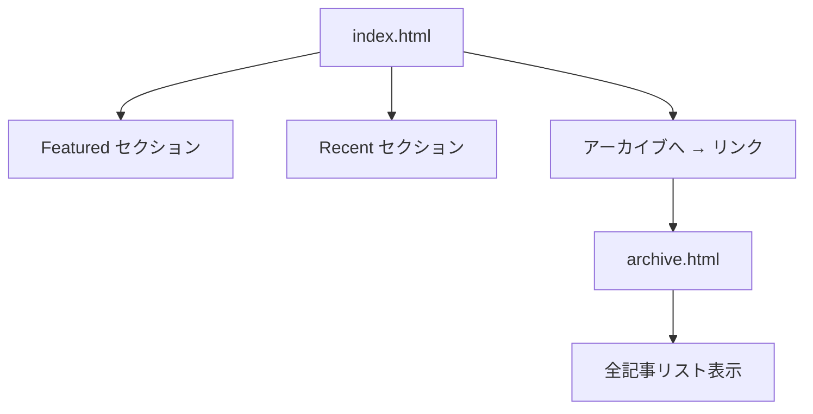

# トップページリデザイン計画

## 背景

全記事が同サイズのカードグリッドで並んでおり、推し記事と小ネタの重みが同じに見える。
情報の重要度を反映したレイアウトに変更する。

## 要件

### ページ構成

| セクション | 表示形式 | 画像 | 最大件数 |
|-----------|---------|------|---------|
| Featured | 現行サイズのカード（グリッド） | あり | ~6本 |
| Recent | 小カード or コンパクトリスト | なし | 残り全部 |
| Archive（別ページ） | リスト（日付・タイトル・プラットフォーム） | なし | 全記事 |

### meta.json の変更

`section` フィールドの値を3種に拡張:

| 値 | 意味 |
|---|------|
| `featured` | トップの Featured セクションに大カードで表示 |
| `recent` | トップの Recent セクションにコンパクト表示（デフォルト） |
| `archive` | トップには出さない。archive.html にのみ表示 |

### 初期 Featured 記事（4本）

- `yojo-pattern-shadow-mask-for-ai-coder`（Yojoパターン）
- `llm-mechanism`（LLM仕組み Part 1）
- `llm-mechanism-2`（LLM仕組み Part 2）
- `llm-mechanism-3`（LLM仕組み Part 3）

### 運用フロー

記事追加時 → 「Featured にする？」をユーザーに確認 → featured / recent を設定

## 実装フェーズ

### Phase 1: build.py の改修

1. `section: "featured"` の振り分けロジック追加
2. Featured 用カードレンダラー（現行の `render_card` そのまま）
3. Recent 用コンパクトカード/リストレンダラー新設
4. archive.html の生成追加
5. トップに「アーカイブへ →」リンク追加

### Phase 2: CSS 追加

1. `.compact-list` / `.compact-item` のスタイル（Recent セクション用）
2. archive.html 用の最小限スタイル（共通CSSを流用）

### Phase 3: meta.json 更新

1. 上記4記事の `section` を `"featured"` に変更
2. Qiita記事群は `"archive"` のまま
3. 残りのZenn記事は `"recent"` のまま

### Phase 4: ビルド＆確認

1. `build.py` 実行
2. ローカルで index.html と archive.html を確認

## 影響範囲

- `build.py` — メイン改修対象
- `index.html` — ビルド出力（自動生成）
- `archive.html` — 新規ファイル（自動生成）
- `articles/*/meta.json` — 4ファイルの section 値変更

## リスク

- **LOW**: LLM記事3本は `platform` / `source_url` がない（他と meta.json の構造が少し違う）→ コンパクトリストで badge が空になるだけ。問題なし
- **LOW**: `build.py` の BLOG_DIR がローカル Temp を指している → 実行環境の確認が必要

## 複雑度: 低
